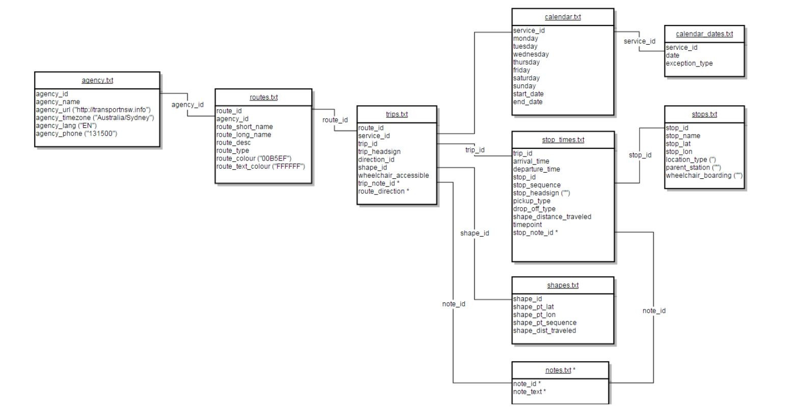

# Realtime gtfs project

## Guide

[Troubleshooting](https://opendata.transport.nsw.gov.au/troubleshooting)  

[tfNSW_Realtime_Train_Technical_Doc](https://opendata.transport.nsw.gov.au/sites/default/files/TfNSW_Realtime_Train_Technical_Doc.pdf)
 
[Google Static Transit](https://developers.google.com/transit/gtfs/reference/#stop_timestxt) 

[How to Use Open Data to Develop an Application](https://opendata.transport.nsw.gov.au/how-use-open-data-develop-application)   

## gtfs API     

[Public Transport - Timetables - For Realtime : ](https://opendata.transport.nsw.gov.au/node/332/exploreapi)  
Static timetables, stop locations, and route shape information in GTFS format for operators that support realtime.  
Public URI: https://api.transport.nsw.gov.au/v1/gtfs/schedule/   
Operations:  
GET /sydneytrains     
GET /buses and /buses/   
GET /ferries    
GET /lightrail/    
GET /nswtrains    
GET /regionbuses/    
GET /metro   

[Public Transport - Realtime Trip Update : ](https://opendata.transport.nsw.gov.au/dataset/public-transport-realtime-trip-update)   
Stop time updates for active trips, replacement vehicles, and changed stopping patterns in GTFS-realtime format for Buses, Ferries, Light Rail, Trains and Metro.  
Public URI: https://api.transport.nsw.gov.au/v1/gtfs/realtime/   
Operations:  
GET /sydneytrains  
GET /buses  
GET /ferries  
GET /lightrail/  
GET /nswtrains  
GET /regionbuses/  
GET /metro   

[Public Transport - Realtime Vehicle Positions : ](https://opendata.transport.nsw.gov.au/dataset/public-transport-realtime-vehicle-positions)     
Current vehicle positions in GTFS-realtime format for Buses, Ferries, Light Rail, Trains and Metro.  
Public URI: https://api.transport.nsw.gov.au/v1/gtfs/vehiclepos/   
Operations:  
GET /sydneytrains  
GET /buses  
GET /ferries  
GET /lightrail/  
GET /nswtrains  
GET /regionbuses/   
GET /metro   

[Public Transport - Realtime Alerts : ](https://opendata.transport.nsw.gov.au/dataset/public-transport-realtime-alerts-0)  
Realtime alerts at either the stop, trip, or service line level in GTFS-realtime format for Buses, Ferries, Light Rail and Trains.    
Public URI: https://api.transport.nsw.gov.au/v1/gtfs/alerts  
Operations:  
GET /sydneytrains  
GET /buses  
GET /ferries  
GET /lightrail  
GET /nswtrains   

## Real-time timetable relationship
The following picture shows the relationship between each file in real-time timetable model:

